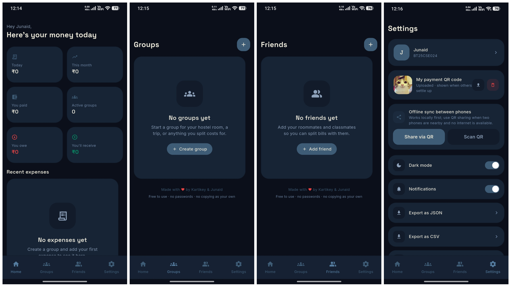

# 💸 Spiliby

Spiliby is an **offline-first expense splitting PWA** for college groups, roommates, travel buddies, or **any group of people who need to split bills easily**.  
No backend, no login — everything is stored locally in IndexedDB on the device.

---

## ✨ Features
- **Create a profile and add friends**  
- **Create groups and add shared expenses**  
- **Split expenses equally, by percentage, or custom amounts**  
- **View who owes what and who should receive money**  
- **Works fully offline**  
- **QR system for sync & payments**:
  - **Share group data by scanning each other’s QR codes**. The app then shows how much each person has to pay or receive.  
  - **Upload your own payment QR code** (e.g., UPI/PhonePe/Paytm). Others can scan it directly to pay you.  
- **Export and import backups as JSON when needed**

---

## 📲 Download the App

[](Spiliby_app/spiliby/spiliby.apk)


### 📸 App Screenshots


---

## 🔄 How Offline Sync Works
1. **Create your group and add expenses** on one phone.  
2. Open **Settings → Share via QR**.  
3. On another phone, open **Settings → Scan QR**.  
4. The app imports and merges shared data, **recalculating balances automatically**.  

If QR sharing is too large, use the JSON export/import flow instead.

---

## ⚙️ Run Locally
```bash
npm install
npm run dev
```

## 📜 License
Copyright © 2026 Kartikey  
All rights reserved. Proprietary license included in the [LICENSE](LICENSE) file.
